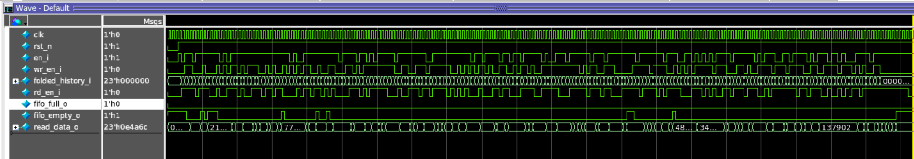

# Synchronous FIFO: ASAP7 clock-gating power comparison

A depth-8, 23-bit synchronous FIFO evaluated with three clock-control implementations: no clock gating, manual RTL clock gating, and synthesis-inserted integrated clock gates (ICGs).

**Synthesis-inserted clock gating reduced estimated total power from 28.54 µW to 12.47 µW—a 56.3% reduction—using ASAP7 RVT TT libraries at 0.7 V and 25°C.** Design Compiler inserted 11 ICG cells, gating all 217 functional register bits.

## Architecture

The FIFO supports independent read and write requests on a common clock, with a registered read output and synchronous full/empty status updates. A global enable pauses transactions while preserving stored data. Active-low asynchronous reset clears the pointers, status flags, and read-output register.

| Parameter | Implementation |
|---|---|
| Depth × data width | 8 × 23 bits |
| Storage | 184 bits implemented with flip-flops |
| Pointer width | 4 bits: 3 address bits + 1 wrap bit |
| Read output | Registered; holds its value between accepted reads |
| Total functional state | 217 bits, including storage, pointers, output and flags |
| Clock constraint | 10 ns / 100 MHz |

Reads are accepted only when the FIFO contains data. Writes are accepted when space is available, including a simultaneous read/write at full occupancy: the oldest word is read and the new word replaces it without changing occupancy. At empty occupancy, a simultaneous request accepts the write and rejects the read.

## Verification

The UVM environment contains a sequencer, driver, monitor and queue-based reference scoreboard. The scoreboard models accepted transactions independently of the RTL pointers and checks read-data ordering, full/empty flags, and output hold behavior on every observed cycle.

| Sequence | Scenarios exercised |
|---|---|
| Basic traffic | Fill, drain, blocked writes and simultaneous read/write |
| Boundary conditions | Reads while empty, writes while full, replacement at full occupancy |
| Control behavior | Global disable, repeated pointer wraparound, reset with buffered data |
| Half-full traffic | Six rounds of half-fill, pause, partial drain, refill and simultaneous traffic |
| Sustained wraparound | Forty simultaneous transfers at occupancy four, followed by drain and an empty-read attempt |
| Random traffic | 200 randomized cycles varying data, enable and read/write requests, followed by drain |

The test defaults to the random sequence. An extended regression selects all six sequences with `+FIFO_EXTENDED_TEST`. Questa uses seed `12345` in the supplied run script. The half-full and sustained-wraparound sequences are new additions awaiting a Questa run.

### Assertion Checks

The RTL includes 11 simulation assertions, excluded from synthesis with `translate_off/on` directives.

| Check | Expected behavior |
|---|---|
| Write/read pointer advancement | An accepted transaction advances its pointer by one, including wraparound |
| Write/read pointer hold | A pointer holds when its transaction is not accepted |
| Read-output hold | Output remains stable without an accepted read |
| Global disable | Pointers, output and flags retain their state |
| Empty/full consistency | Flags agree with the current pointer relationships |
| Flag exclusivity | Full and empty are never asserted together |
| Known state | Pointers and status flags contain no X/Z after reset |
| Asynchronous reset | Pointers and output clear; empty asserts and full clears |

The assertions supplement the queue scoreboard's data-ordering checks. They are newly implemented; assertion pass results will be recorded after simulation. Existing power results predate these verification additions.

Clock-Gating Comparison

Three implementations were evaluated:

- **Ungated:** enable-controlled RTL synthesized without clock-gating insertion.
- **Manual RTL gating:** an earlier implementation with explicit latch-based read and write clock gates.
- **Tool-inserted ICG:** enable-controlled RTL synthesized with `compile_ultra -gate_clock`, using the library cell `ICGx1_ASAP7_75t_R`.

The current gated and ungated runs use the same FIFO RTL. In the ICG implementation, clock enables are separated into eight memory-word groups, a write-pointer group, a read-pointer/output group, and a status-flag group. This allows inactive words and registers to stop receiving clock transitions.

| Synthesis result | Ungated | Tool-inserted ICG |
|---|---:|---:|
| Inserted clock gates | 0 | 11 |
| Gated register bits | 0 / 217 | 217 / 217

## Reported power results

**ASAP7 7 nm, RVT TT, 0.7 V, 25 C.** Values are averaged, pre-layout power estimates; no wire-load model was set.

| Metric | Ungated | Manual RTL gating | Tool-inserted ICG |
|---|---:|---:|---:|
| Internal power | 25.790 uW | 13.530 uW | 8.915 uW |
| Net switching power | 2.665 uW | 4.927 uW | 3.484 uW |
| Leakage power | 0.07795 uW | 0.07626 uW | 0.06930 uW |
| **Total power** | **28.54 uW** | **18.54 uW** | **12.47 uW** |
| **Reported reduction versus ungated** | **Baseline** | **35.0%** | **56.3%** |
| Clock-network subtotal (included above) | 22.740 uW | 12.180 uW | 3.879 uW |

The ICG estimate is **16.07 uW below ungated** and **32.7% below the historical manual-gating result**. The two recent runs read the same `sync_fifo.saif`. The manual-gating run is an earlier reference, not a fully revalidated matched experiment.

## Clock-gating implementation

| Result | Ungated | Tool-inserted ICG |
|---|---:|---:|
| Tool-inserted clock gates | 0 | 11 |
| Gated register bits | 0 | 217 |
| Ungated register bits | 217 | 0 |

The mapped gates are `ICGx1_ASAP7_75t_R`. Inspected connections show separate `write_enable` and `read_enable` gates, an `en_i` gate for flags, and eight memory-word gates. All ICG test-enable inputs are tied low through `TIELOx1_ASAP7_75t_R`, so test override is inactive. Register coverage is not a percentage power saving.

## Interpretation and evidence status

- Internal power is energy used inside cells; net switching charges driven capacitance; leakage remains while cells are powered.
- FIFO storage is implemented as registers, explaining the zero memory-macro power group.
- Gated and ungated SAIF reports were captured before `update_power`; final activity propagation, especially ICG clock activity, still needs inspection.
- Out-of-range ramp/load counts: ungated **33/23**, manual **34/27**, ICG **44/207**. These limit confidence in the comparison.
- Area savings are not claimed: matching area reports have not been archived here.

The results above are verified against the imported reports: [manual RTL](results/reports/manual_rtl/sync_fifo_power_verbose.rpt), [ICG](results/reports/icg/sync_fifo_power_verbose.rpt), and [ungated](results/reports/ungated/sync_fifo_power_verbose.rpt). The supplied RTL, four DC/PT scripts, Questa run script, exported SDCs and 27 reports are archived unchanged. [Import manifest](results/import_manifest.csv) records their original archive paths and SHA-256 hashes.

The testbench, simulation UPF and original synthesis SDC have also been added. Mapped netlists and matching SAIF are still needed for the archived PrimeTime flow. See the [import review](docs/import-review.md) for two corrections made to the newly supplied files.

## Simulation waveform

User-supplied waveform showing enable, read/write requests, data and status outputs. A waveform alone does not establish scoreboard pass status or activity coverage; the simulation transcript is still pending.

Tools and Power Intent

| Stage | Tools / inputs |
|---|---|
| RTL and verification | SystemVerilog, UVM, QuestaSim |
| Synthesis and clock-gate insertion | Synopsys Design Compiler |
| Timing and power analysis | Synopsys PrimeTime, SAIF activity, SDC constraints |
| Technology | ASAP7 7 nm standard cells, RVT TT |
| Simulation power intent | UPF single-domain supply at 0.7 V

## Repository layout

| Directory | Intended contents |
|---|---|
| `rtl/` | Final standalone FIFO RTL and historical manual-gate version |
| `tb/` | UVM testbench, packages and sequences |
| `constraints/` | SDC used for both comparisons |
| `scripts/` | Actual DC, PrimeTime and Questa scripts |
| `netlist/` | Exported gated and ungated SDCs; mapped Verilog pending |
| `upf/` | Optional standalone simulation power intent, clearly labeled |
| `results/` | Summary data and original result reports |
| `docs/` | Theory, design decisions, evidence notes and waveform figures |

Current standalone synthesis and PrimeTime scripts do **not** load UPF. The separate mixed-library registered-wrapper experiment is documented in project history, but its results are not these standalone FIFO numbers.

The supplied `run_sync_fifo.do` is stored at the repository root and loads `upf/sync_fifo_upf.upf` for simulation.

See [design notes](docs/design-notes.md), [results data](results/power_summary.csv), and the [file intake checklist](docs/file-intake.md).

Technology libraries and vendor tools are not bundled. Use appropriately licensed local installations. No license for publishing third-party library content is implied.
